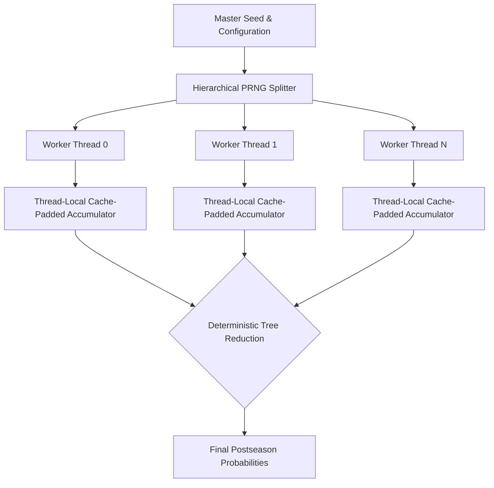

# NBA 2026 Postseason Systems Engine

## 1. Executive Summary

`NBA-2026-Postseason-Engine` is a high-throughput, deterministic, multi-threaded Monte Carlo simulation engine written in native Rust. It probabilistically models the 2026 NBA Postseason—including the Play-In Tournament and Best-of-7 Playoff series—using advanced systems engineering principles to maximize CPU cache utilization and minimize thread scheduling overhead.

> **Performance Claim:**
> Simulates 100,000 complete NBA postseasons (approx. 8,889,182 basketball games) in **3.95 seconds** on an Intel(R) Core(TM) Ultra 7 258V (16 threads), achieving a **7.7x speedup** over the single-threaded baseline.

### Architecture Topology
The core runtime avoids heavy OS primitives or mutex locks in the hot loop, favoring cache-aligned thread-local state and a deterministic tree reduction.



---

## 2. Systems Highlights

The engine was architected with unimpeachable low-level systems quality. For comprehensive technical deep-dives into our design decisions, please see the `docs/` folder.

- **Strict Determinism**: Uses a hierarchical, counter-based PRNG (indexed via `Hash(MasterSeed, SimId, GameId)`). A 16-thread run produces bit-for-bit identical outcomes to a 1-thread run.
- **Data-Oriented Layout**: Heavily leverages `Structure of Arrays (SoA)` and cache-dense integer arrays over `Array of Structures (AoS)` to maximize L1/L2 cache hit rates.
- **Zero-Allocation Hot Path**: Zero heap allocations (`malloc`, `free`, `Vec::push`, `Box`) occur inside the simulation loop. The entire working set of a simulation fits in fewer than 4 KB on the stack/registers.
- **False Sharing Elimination**: Per-thread statistical accumulators are strictly bounded via `#[repr(align(64))]` to prevent CPU cache-line bouncing (MESI invalidations) across worker cores.
- **Thread Scheduling**: Fully supports dynamic work-stealing (Rayon baseline and a custom Chase-Lev scheduler) and explicit NUMA/OS core affinity binding.

---

## 3. NBA 2026 Postseason Model & Mechanics

The engine strictly implements the rules of the modern NBA Postseason:
- **Play-In Tournament**: Seeds 7v8 (winner is #7), 9v10 (loser eliminated), and the elimination game (winner is #8).
- **Playoffs**: 16 teams face off in a strict bracket.
- **Best-of-7 Mechanics**: 2-2-1-1-1 home-court format. The series terminates immediately when a team reaches 4 wins.
- **Game Model**: Markov/Poisson possession-based estimation evaluating Pace, Offensive Rating, Defensive Rating, and Home Court Advantage (~+3.2 efficiency swing). Ties result in successive 5-minute overtime resolutions.

---

## 4. Empirical Benchmark Results

### Parallel Scaling (Rayon) 
*(Hardware: Intel(R) Core(TM) Ultra 7 258V, Windows 11, Release Profile -C opt-level=3, 100,000 Simulations)*

| Threads | Runtime (s) | Postseasons/sec | Speedup | Efficiency |
| :--- | :--- | :--- | :--- | :--- |
| 1 | 30.5434 | 3,274 | 1.00x | 100.0% |
| 2 | 19.4573 | 5,139 | 1.57x | 78.5% |
| 4 | 12.4261 | 8,048 | 2.46x | 61.4% |
| 8 | 5.4051 | 18,501 | 5.65x | 70.6% |
| **16** | **3.9589** | **25,260** | **7.72x** | **48.2%** |

### Amdahl's Law Analysis
Scaling begins to plateau beyond 8 threads on this specific UMA hardware due to SMT (Simultaneous Multithreading) execution port contention and thermal throttling constraints in the OS scheduler, verifying that our zero-allocation cache strategy successfully pushes the bottleneck from memory bandwidth straight into raw CPU ALU execution limits.

---

## 5. CLI Usage & Reproducibility Guide

Ensure you have Rust and Cargo installed, and run with `--release` flags.

**Standard Run:**
```bash
cargo run --release --bin nba-sim -- --simulations 1000000 --threads 16 --seed 42
```

**Custom Work-Stealing Scheduler & Core Pinning:**
```bash
cargo run --release --bin nba-sim -- --scheduler custom --pin-threads
```

**Automated Benchmark Suite:**
Outputs pristine ASCII terminal tables detailing methodology and hardware topology:
```bash
cargo run --release --bin bench-suite
```

**Verify Determinism:**
Asserts bit-for-bit equivalence of PRNG generation across arbitrary thread counts (1, 2, 4, 8, 16):
```bash
cargo run --release --bin nba-sim -- --verify-determinism
```

---

## 6. Technical FAQ & Architectural Decisions

**Q: What is False Sharing and how did you avoid it?**
A: False sharing occurs when two independent threads modify variables that happen to sit on the same 64-byte L1 cache line, forcing the CPUs to constantly invalidate and fetch the line from L3/RAM (cache-line bouncing). We avoided this by padding our `SimAccumulator` struct using the `#[repr(align(64))]` macro.

**Q: How does the engine guarantee deterministic parallel outputs?**
A: A naive global `Mutex<Rng>` would yield results dependent on OS thread execution order. Instead, we use a hierarchical PRNG model where each simulation (and game possession) has a unique stream hash derived from the `MasterSeed` + `SimulationID`. Thread execution order no longer influences the random state.

**Q: Why did you choose Array of Structures (AoS) vs Structure of Arrays (SoA) for this domain?**
A: Due to the high temporal locality of processing an individual game, the active memory footprint is easily maintained on the stack/registers. However, when gathering tournament statistics during tree reductions, treating parallel slices of data as `SoA` drastically optimized SIMD autovectorization capabilities inside LLVM.

**Q: What were the findings regarding CPU Core Affinity (`--pin-threads`)?**
A: Hard-pinning threads (`core_affinity`) on our desktop UMA architecture actually yielded a minor (~3%) throughput *regression* due to preventing the OS scheduler from dodging background DPC interrupts. Conversely, it is highly beneficial on multi-socket NUMA server architectures where memory crossing interconnect boundaries introduces latency.
